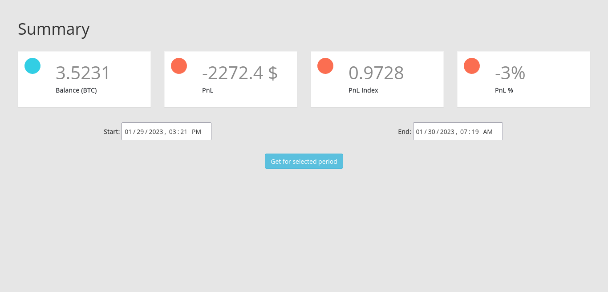
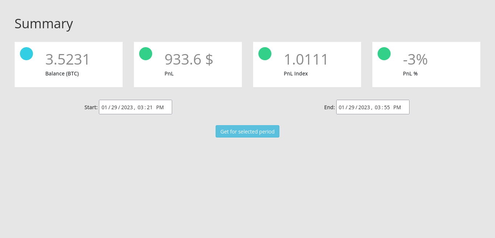

[Template source: https://gist.github.com/DomPizzie/7a5ff55ffa9081f2de27c315f5018afc]::
# Тестовое задание

## Описание

### Диаграма архитектуры


## Getting Started

В программе реализовано два контроллера, которые могут работать независимо друг от друга:
- Веб интерфейс;
- Воркер, который запускает расчет.

### Перед запуском

Для начала нужно установить необходимые зависимости
```bash
pip install -r requirements.txt
```

### Запуск веб интерфейса

```bash
python web_django/manage.py runserver
```

#### Скриншоты



### Запуск воркера

Перед запуском нужно отредактировать файл `.env.dist` и заполнить необходимые переменные
```bash
mv .env.dist .env && vim .env

# После формирования .env файла можно запускать воркера
python main.py
```

## NOTES
Во время выполнения задания мне захотелось поэксперементировать с Django ORM и архитектурным подходом :)

У меня были требования:
- Контроллеры не должны зависить друг от друга;
- В инфраструктурном слое для реализации хранилища использовать Django ORM;

---
К сожалению, не смог пока выделить время чтобы избавиться от этой строки в веб контроллере :(
```python
# file: web_django/web_django/settings.py

INSTALLED_APPS = [
    'django.contrib.auth',
    'django.contrib.contenttypes',
    'django.contrib.sessions',
    'django.contrib.messages',
    'django.contrib.staticfiles',
    'web',
    'services.orm',   <=========
]
```

---
К сожалению, всё из-за того же времени документация присутствует только в следующих модулях:
- `domain/entities.py`
- `domain/value_objects.py`
- `usecases.py`
